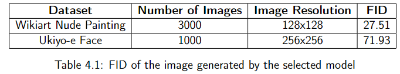

# An Evaluation of Art Synthesis on Modern GAN Models

The content below summarizes the original work. For the full details, please refer to: [Link to PDF](nu/chia_khc_dissertation_2022_23.pdf)

## Table of Contents
1. [Abstract](#abstract)
2. [Qualitative Evaluation](#qualitative-evaluation)
   - [Ukiyo-e Augmentation Leakage Results](#ukiyo-e-augmentation-leakage-results)
   - [Body Painting Struggles](#body-painting-struggles)
   - [Body Painting Results](#body-painting-results)
3. [Quantitative Results](#quantitative-results)
   - [Nearest Neighbour Results](#nearest-neighbour-results)
   - [Fréchet Inception Distance (FID) Results](#frechet-inception-distance-fid-results)
4. [Code Information](#code-information)
   - [downsize.py](#downsizepy)
   - [L2.py](#l2py)
   - [stylegan2-ada-pytorch-main](#stylegan2-ada-pytorch-main)
5. [Citation](#citation)

## Abstract
Artificial Intelligence (AI) image synthesis has become a prominent field in recent years, with Generative Adversarial Networks (GANs) playing a significant role in its advancement. Although GAN models can generate high-quality images with various components, they generally adhere to the classic GAN architecture consisting of a Generator (G) and a Discriminator (D). Despite their success in creating realistic images, there is limited literature on GAN models specifically for art generation. This paper explores the differences between real-world images (such as those of humans, birds, and cars) and art images, using the modern StyleGAN2-ADA PyTorch model to evaluate the quality of generated art.

## Qualitative Evaluation

### Ukiyo-e Augmentation Leakage Results
<div align="center">
  
</div>

The generated images successfully display a variety of facial features. However, there are issues with augmentation leakage during dataset training, leading to a predominant pink theme in the results. The generator tends to overfit to images with a pink theme due to lower loss values, causing color augmentations to affect the generated results.

### Body Painting Struggles
<div align="center">
  
</div>

The figure illustrates the model's difficulty in generating images of the subject lying down. A noticeable trend in these generated images is the recurring feature circled in red, which appears in most attempts to depict the subject in a reclining position.

### Body Painting Results
<div align="center">
  <table>
    <tr>
      <td></td>
      <td></td>
    </tr>
  </table>
</div>

The progression in image quality from the dataset trained model is evident. Initially, the model produces brighter paintings with less detail and body shape. Over time, it generates images with a darker theme, improved detail, and more defined body features, showing significant enhancement.

## Quantitative Results

### Nearest Neighbour Results
<div align="center">
  
</div>

- Results from our trained model: The red-bordered image is the real image, while the three images surrounding it on the right are the nearest neighbors generated by the model.
- Distance measurements between real and generated images are shown, with the real image 1 being the leftmost image with a red box around it.

### Fréchet Inception Distance (FID) Results
<div align="center">
  
</div>

Fréchet Inception Distance (FID) is used to quantitatively assess image quality by measuring the difference between feature distributions of real and generated images. A lower FID score indicates better image quality and closer alignment between real and generated images.

As demonstrated, the Nude Painting (Body Painting) model achieved a lower FID score, reflecting superior image quality in its generated outputs.

## Code Information

### downsize.py
This script downsizes images and converts them to RGB mode.

1. **Training set:** Includes the dataset images you wish to train, ensuring none have an alpha channel.
2. **Output Folder:** Should be empty, as processed images will be saved here.

**Note:** Run this script first to standardize image sizes.

### L2.py
1. **Training set:** Includes the dataset images you wish to train, with all images standardized in size.
2. **Generate image output:** Contains the generated images from the model. A sample image can be found within the .zip folder.

### stylegan2-ada-pytorch-main
This code is from: [StyleGAN2-ADA PyTorch](https://github.com/NVlabs/stylegan2-ada-pytorch)

## Citation
```bibtex
@inproceedings{Karras2020ada,
  title     = {Training Generative Adversarial Networks with Limited Data},
  author    = {Tero Karras and Miika Aittala and Janne Hellsten and Samuli Laine and Jaakko Lehtinen and Timo Aila},
  booktitle = {Proc. NeurIPS},
  year      = {2020}
}
