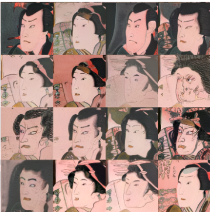
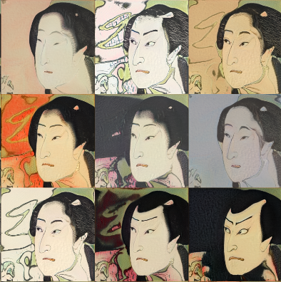
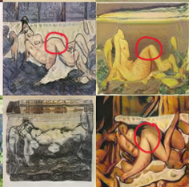
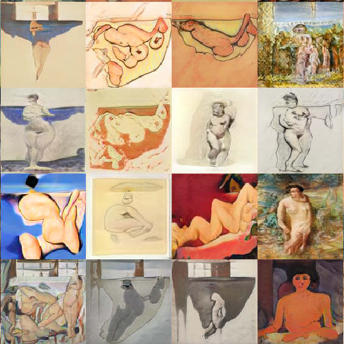
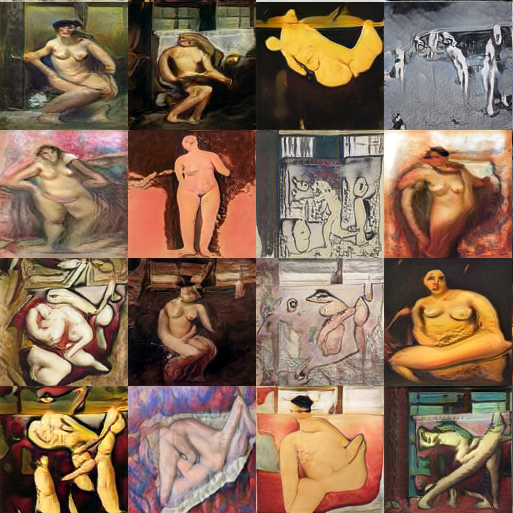

# An Evaluation of Art Synthesis on Modern GAN Models

## Abstract
Artificial Intelligence (AI) image synthesis is one of the most influential topics in recent years, and Generative Adversarial Network (GAN) is undoubtedly one of the influential contributors to the progression of image synthesis. While there are many different variations of the GAN model that can synthesize high-quality images with very different components, the overall architecture still stays true to the GAN model of having a Generator (G) and a Discriminator (D). However, existing GAN image synthesis models that produce images from a noise image have neglected art synthesis as the amount of literature about GAN models that step into the field of art generation is very limited in terms of quantity. This paper will delve into the differences between real-life images, such as pictures of humans, birds, and cars, and art images, and utilize a modern image synthesis model, StyleGAN2-ADA PyTorch version, to evaluate the generated art images.

## Code Information

### downsize.py
The purpose of this code is to downsize the images and convert the color mode of the images to RGB.

1. **Training set:** This folder should include the dataset images you wish to train and make sure that none of the images have an alpha channel.
2. **Output Folder:** This folder should be empty, this is where all the processed images will go.

**Remark:** Make sure to run this code first to ensure all the images are the same size.

### L2.py
1. **Training set:** This folder should include the dataset images you wish to train and make sure that none of the images have an alpha channel. Note that at this stage, the training set is the processed images that share the same size.
2. **Generate image output:** This should contain the generated image that the model has produced. A sample image can be found within the .Zip folder.

### stylegan2-ada-pytorch-main
This code belongs to: [StyleGAN2-ADA PyTorch](https://github.com/NVlabs/stylegan2-ada-pytorch)


# Qualitative Evaluation

## Ukiyo-e Face Results






## Body Painting Results





## Nearest Neighbour Results

Results generated with our trained model: Images in the red line are the real images, the 3 images surrounding the real image with the red line from the right are the nearest neighbour generated images of the real image.

## Citation
```bibtex
@inproceedings{Karras2020ada,
  title     = {Training Generative Adversarial Networks with Limited Data},
  author    = {Tero Karras and Miika Aittala and Janne Hellsten and Samuli Laine and Jaakko Lehtinen and Timo Aila},
  booktitle = {Proc. NeurIPS},
  year      = {2020}
}
